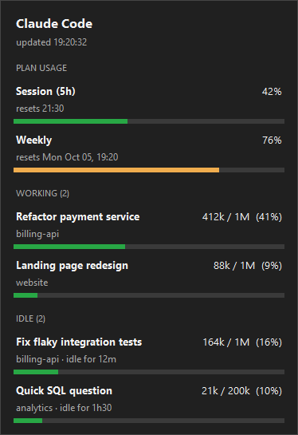

# Claude Usage Tray

A small Windows system tray app that shows your **Claude plan usage** (the same numbers as `/usage`) and the **context size of every active Claude Code conversation** (like `/context`). You don't have to type a command in each session.

<p>
  
</p>

- **Tray icon:** shows your current 5-hour session usage. The color reflects the worst of all indicators: green, then amber from 70%, then red from 90%.

  

- **Hover:** a one-line summary.
- **Left click:** a details panel with session and weekly limits, their reset times, and your open conversations with their title, project and context usage. Working and idle conversations are in separate groups, sorted by context usage (largest first) and then by most recent activity. Idle ones show how long they've been idle. Conversations idle for more than 24 hours are only counted, not listed, and the idle list is shortened to fit your screen.
- **Right click:** Details, Refresh now, Quit.
- **Notifications:** a Windows notification when a plan limit crosses 80% and 95%.

Works with the Claude Code CLI and the IDE extensions (VS Code, JetBrains). Every open conversation on the machine is listed.

## Requirements

- Windows 10 or 11
- Python 3.10+ on `PATH` ([python.org](https://www.python.org/downloads/), with the "tcl/tk" option, which is on by default)
- Claude Code signed in with a Claude subscription (Pro/Max). Plan usage is not available for API-key logins, but context tracking still works.

No admin rights needed.

## Install

```powershell
git clone https://github.com/daniellimabr/claude-usage-tray.git
cd claude-usage-tray
powershell -ExecutionPolicy Bypass -File install.ps1
```

The script:

1. creates a local virtual environment
2. installs `pystray` and `Pillow`
3. adds a shortcut to your Startup folder, so the app starts when you sign in
4. starts the app

If the icon doesn't show up, look under the hidden icons arrow (^) in the taskbar and drag it out.

## How it works

Everything is read locally, except one HTTPS call for plan usage.

| What | Where it comes from |
|---|---|
| Active conversations | `~/.claude/sessions/<pid>.json`, one file per running Claude Code process. The app checks that the process is still alive. |
| Conversation title | The latest `ai-title` (or your custom name) in the conversation transcript, `~/.claude/projects/*/<sessionId>.jsonl` |
| Context size | The token usage of the last main-agent response in that transcript (input + cache + output). Subagent messages are ignored. |
| Plan usage | `GET https://api.anthropic.com/api/oauth/usage`, the endpoint Claude Code's `/usage` uses, authenticated with your existing Claude Code login |

**Refresh intervals:**
- Context: every 10 seconds.
- Plan usage: every 5 minutes.
- "Refresh now": re-queries plan usage at most once a minute.
- When the server rate-limits (HTTP 429), the app waits the `Retry-After` time.

## Authentication

The app never asks you to sign in and has no login of its own. It reuses the login Claude Code already stored on your machine.

- **Signed in to Claude Code with a subscription (`/login`):** plan usage works right away.
- **Not signed in, or using an API key:** the panel says so and still shows context for your open conversations. Once you sign in to Claude Code, plan usage appears on the next refresh without restarting the app.

## Privacy and security

- **Your OAuth token:** the app reads it from `~/.claude/.credentials.json` and sends it only to `api.anthropic.com`. It is never logged, stored elsewhere or refreshed. Refreshing would rotate Claude Code's own refresh token.
- **Conversation contents:** never sent anywhere. The app only reads token counts and titles.
- **No telemetry, no other network calls.**
- **Log file:** `claude_usage_tray.log` in the app folder contains only errors and timestamps.

The code is a single file, [`claude_usage_tray.py`](claude_usage_tray.py), so please read it before running.

## Limitations

- **Undocumented usage endpoint.** Anthropic can change or remove it at any time. If that happens, the panel shows an error and context tracking keeps working.
- **Expired login.** If Claude Code hasn't run for a while, its access token expires and the panel shows "token expired: open Claude Code". It recovers once Claude Code refreshes the token.
- **Approximate context.** It is estimated from the last response. It is close to `/context` but not identical, and it appears only after a conversation's first response.
- **Assumed context window:** 1M tokens for Opus, Sonnet and Fable models, 200k for Haiku.
- **Windows only.** It uses Win32 APIs for process checks, the single-instance lock and panel placement.

## Uninstall

```powershell
powershell -ExecutionPolicy Bypass -File uninstall.ps1
```

Then delete the folder.

## Disclaimer

This is an unofficial community project. It is not affiliated with, endorsed by or supported by Anthropic. "Claude" and "Claude Code" are trademarks of Anthropic.

## License

[MIT](LICENSE)
